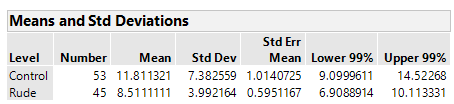

## Comparing Two Population Means: Independent Sampling.
In the Academy of Management Journal, a study set out to investigate if rude behavior negatively affects work performance. Students in a management course were randomly seperated into two experimental conditions : rudeness (n=45) and control (n=53). Students were asked to write down as many uses for a brick as possible in five mintutes; this value would be a performance measure for each student.

Students in the rudeness conditions were berated by the facilitator about being irresponsible and unproffesional because of a late-arriving confederate. In the control group, no comment was made about the late-arriving confederate. We will use a two sample z-test to see if the true mean performace level of the rudeness group is less than the true mean performance level for the control group. 

### Conditions Required for Valid Large-Sample Inferences about u1 - u2
1. The two samples are randomly selected in an independent manner from the target populations.
2. The sample sizes, n1 and n2, are both large (more than 30). This guaarantees by the Central Limit Theorem that the sampling distribution of (x-bar1-x-bar2) will be normal and that the standard variance of both samples will be good approximations for the corresponding population variances. 

Since the students were randomly divided into our two conditions and the scores of one sample are not dependent on the scores of the other sample, we will consider the first assumption to be fulfilled. Both of our sample sizes are above 30 so the second assumption is also fulfilled.

### Large Independent Samples Test of Hypotheses for (u1-u2)
We want to see if the true mean performace level of the rudeness group (u1) is less than the true mean performance level for the control group (u2). We will use a level of significance of .01 for this test

Ho: (u1-u2) = 0

Ha: (u1-u2) < 0

## Test Statistic



Using the formula z = (x-bar1 - x-bar2) - 0 / sqrt( (s^2 / n1) + (s^2 / n2) ) and the information above, we find that our test statistic z is -2.80772. To use a rejection zone, we need to know the z critical value corresponding to an area of .01. Looking at a table, we find that z(.01) = -2.33. Since -2.80772 < -2.33, we have enough evidence to prove that the true average performance level of the rudeness group is lower than the control's group average performace level. To find the p-value, we need to find the P(z <-2.80772). Looking at the table, we find that z(-2.81) = .4975. Our p-value is 1-.4975 = .0025. Since this number is lower than our alpha, we can reject the null hypothesis.

### Large Independent Samples Confidence Interval for u1 - u2.

We construct a 99% confidence interval by using the formula (xbar1-xbar2) +/- 2.33 * sqrt( (s^2 / n1) + (s^2 / n2) ). Since this is a one sided-test, we only report the second part of the interval. We are 99% confident that the true mean performance level of the rudeness group is (-Inf, -0.5617) less than the mean performance level of the control group.

### Doing the Test in R
```
library(BSDA)
library(tidyverse)
workplace <- read.csv("RUDE.csv",header = TRUE)

#Seperates Data into Two Conditions

rude <- workplace %>%
  filter(Condition=="Rude")
control <- workplace %>%
  filter(Condition=="Control")

z.test(rude$UsesBrick,control$UsesBrick,alternative = "less",mu=0,sigma.x=3.992164,sigma.y=7.382559,conf.level = .99)

###Two-sample z-Test

### data:  rude$UsesBrick and control$UsesBrick
### z = -2.8068, p-value = 0.002502
### alternative hypothesis: true difference in means is less than 0
### 99 percent confidence interval:
### NA -0.5648886
### sample estimates:
### mean of x mean of y 
    8.511111 11.811321 
```


